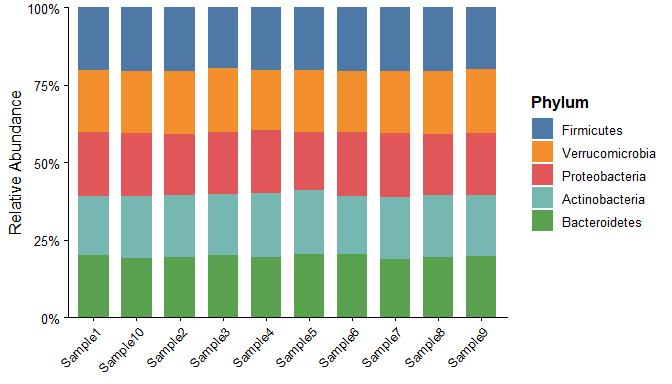
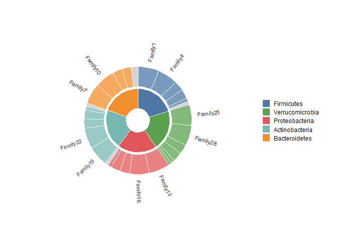
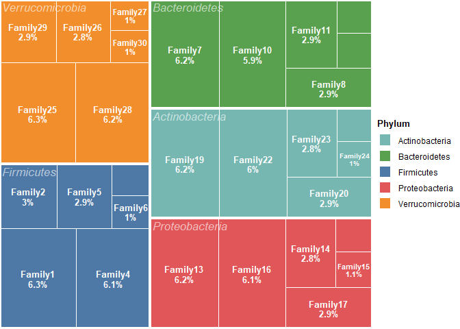
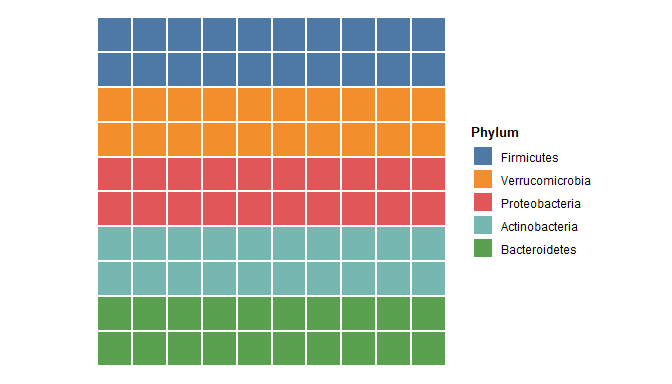
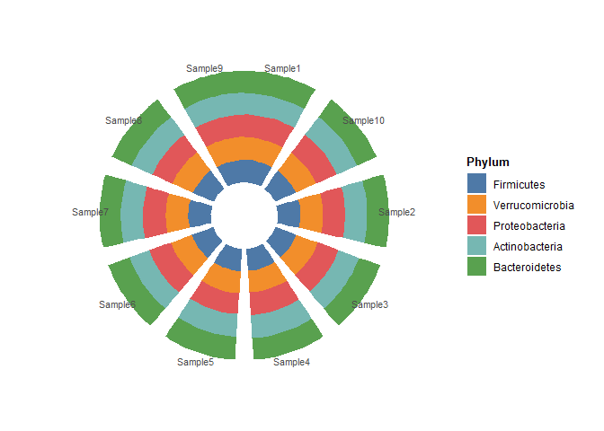
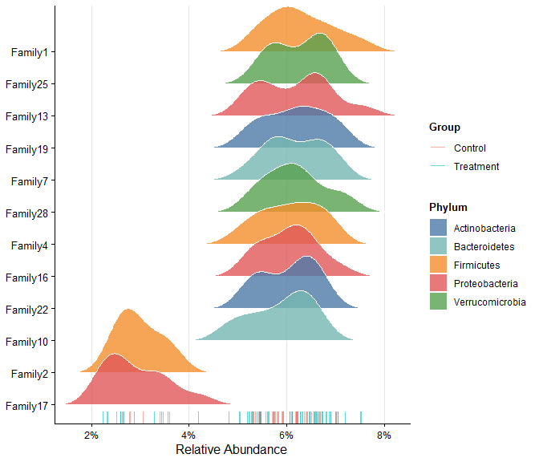
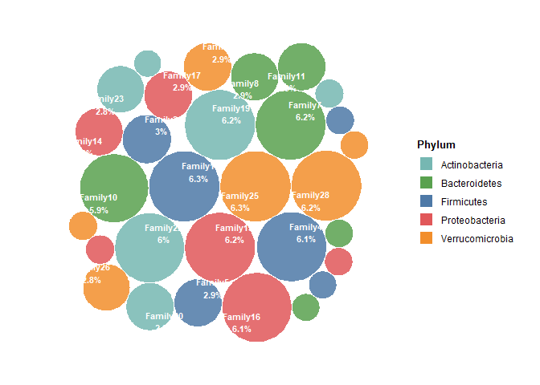

# micomposition

<!-- badges: start -->
<!-- badges: end -->

**micomposition** is an R package for visualizing microbiome composition
data from 16S rRNA amplicon sequencing or metagenomic studies. It
provides publication-ready plots with minimal code.

## Installation

``` r
# Install from GitHub
# install.packages("remotes")
remotes::install_github("YINGSAOVO/micomposition")
```

## Quick Start

``` r
library(micomposition)

# Built-in demo dataset
data(demo_data)
str(demo_data, max.level = 1)
#> List of 3
#>  $ otu_table  : num [1:10, 1:30] 0.059 0.0544 0.0618 0.0592 0.0673 ...
#>   ..- attr(*, "dimnames")=List of 2
#>  $ tax_table  :'data.frame': 30 obs. of  7 variables:
#>  $ sample_data:'data.frame': 10 obs. of  3 variables:
```

## Stacked Bar Chart

``` r
plot_bar_stack(demo_data, level = "Phylum")
```



## Sunburst Chart

``` r
plot_sunburst(demo_data, levels = c("Phylum", "Family"))
```



## Treemap

``` r
plot_treemap(demo_data, level = "Family")
```



## Waffle Chart

``` r
plot_waffle(demo_data, level = "Phylum")
```



## Radial Bar Chart

``` r
plot_radial_bar(demo_data, level = "Phylum")
```



## Ridge Plot

``` r
plot_ridge(demo_data, level = "Family", group_by = "Group")
```



## Bubble Chart

``` r
plot_voronoi_static(demo_data, level = "Family")
```



## Input Data Format

All functions accept a named list with three elements:

``` r
data <- list(
  otu_table   = otu_rel,    # numeric matrix: samples × OTUs (relative abundance)
  tax_table   = tax_df,     # data.frame: OTU × taxonomic ranks
  sample_data = sample_df   # data.frame: sample metadata
)
```

Supported input formats (coming soon): `phyloseq`, MetaPhlAn,
Kraken/Bracken.

## Citation

If you use micomposition in your research, please cite:

> Your Name (2025). micomposition: Visualization Tools for Microbiome
> Composition Data. R package.
> <https://github.com/YINGSAOVO/micomposition>
